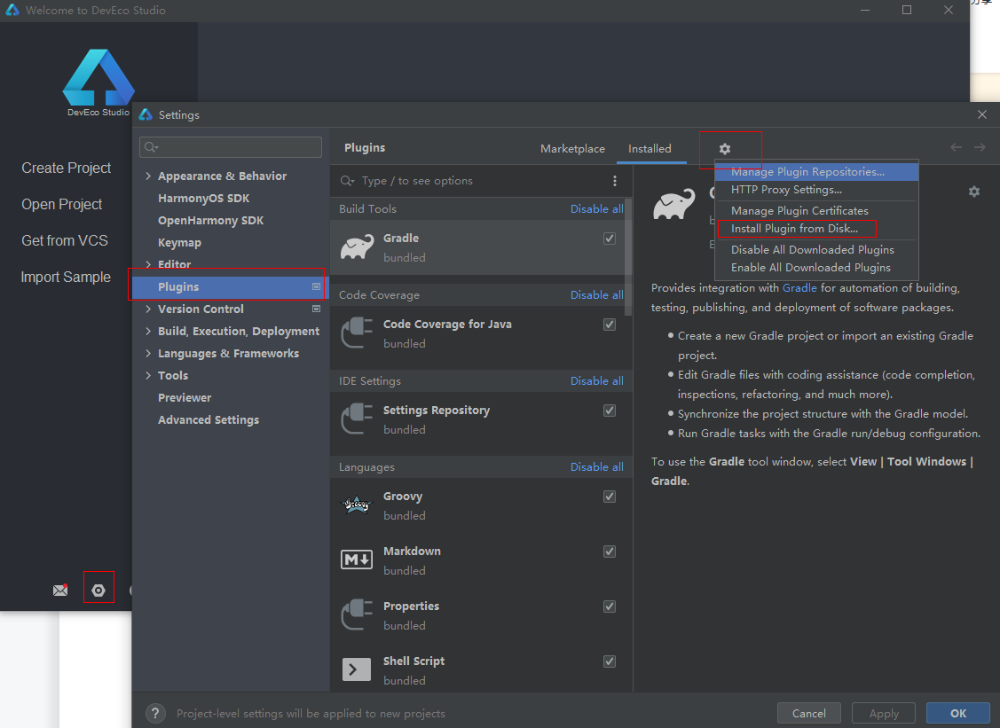
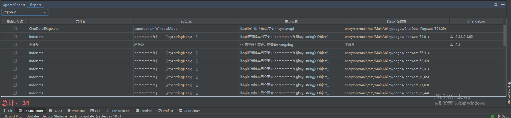
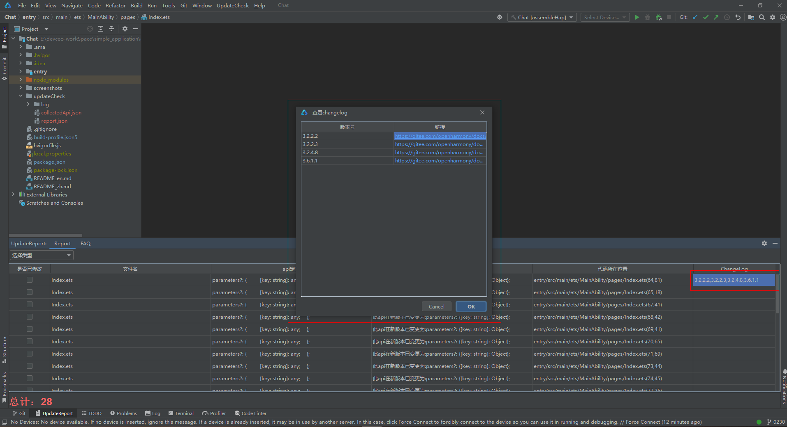

**SDK升级辅助工具说明书**

# 背景
在研Beta版本API不承诺兼容，而应用开发者在对现有APP工程切换SDK版本时，需适配API接口及底层行为的变更，存在升级成本；因此需要提供SDK升级辅助工具，开发者按照提供的升级报告可得知升级适配全貌，并通过工具点击跳转到接口变更处在工具提示下快速进行适配升级，SDK升级效率可显著提高。

# 工具安装




*按图示进入设置Plugins页面，然后选择updateCheck-1.0-SNAPSHOT.zip（注意：插件安装完成后需要重启IDE）*

# 使用工具

- *辅助升级插件安装好后，打开需要升级的OpenHarmony工程*

- *工程加载完毕后，通过窗口上方的主菜单栏UpdateCheck=>Start进入；*


- *新版本SDK已通过IDE配置文件及当前应用配置的SDK版本自动获取到。手动选择旧版本SDK路径，到ets文件夹，点击确定开始生成辅助升级报告*


- *报告生成成功后会提示，点击OK按钮，关闭当前弹窗*


- *根据弹窗提示，打开下方工具栏内UpdateReport按钮，查看升级报告*



# 报告功能点

1. *报告下方总数为因升级SDK导致当前应用出现的问题总数，帮助快速评估修改工作量*
2. *报告的每个标题头都可以单击进行排序*
3. *报告中选择类型下拉框可以选择升级类型原因，下方总计会根据选择的类型更改数量*
4. *是否已修改功能可以帮助开发者记录哪些问题已修改，避免出现重复工作量*
5. *双击代码所在位置列，可以快速定位到当前代码在应用中位置*
6. *提示信息列会提供修改建议，供开发者参考修改*
7. *changelog列如果多个版本，单击之后会出现弹出框，将版本号和链接罗列，点击进行跳转。单个版本变更，单击之后，直接跳转到对应的ChangeLog文档中*
   

# 工具源码使用教程

## 1、interface仓中clone以下两个工具到本地


## 2、在api_diff工具和collect_application_api工具目录下进入终端，进行安装和编译。输入命令：npm install，之后进行构建：npm run build。</br>构建成功之后，会在对应的工具文件夹下生成dist=>build=>api-diff.js和dist=>build=>api-collectort.js


## 3、在本地磁盘的最后一个盘符，创建名为'updateCheck'文件夹，内部分别创建'api-diff'和'collect_application_api'文件夹。</br>将上图diff.js文件放置'api-diff'文件夹下，将上图collect_application_api文件夹下lib文件夹以及上图api-collector.js放置在'collect_application_api'文件夹下。


## 4、升级辅助工具源码clone下来之后，在idea上打开，需要配置gradle换将，并且在src同级目录下新建'build.gradle.kts'文件，将下面内容粘贴至文件中，刷新gradle，在idea右侧gradle工具栏即可运行项目和打包成插件。
```lombok.config
plugins {
    id("java")
    id("org.jetbrains.intellij") version "1.5.2"
}

group = "com.example"
version = "1.0-SNAPSHOT"

repositories {
    maven {
        setUrl("https://mirrors.huaweicloud.com/repository/maven")
    }
}

dependencies{
    implementation("org.springframework:spring-web:5.2.12.RELEASE")
    implementation("org.apache.commons:commons-compress:1.21")
    implementation("com.alibaba:fastjson:1.2.28")
    implementation("org.apache.logging.log4j:log4j-core:2.19.0")
    implementation("commons-httpclient:commons-httpclient:3.1")
}

intellij {
    version.set("2021.2")
    type.set("IC") // Target IDE Platform

    plugins.set(listOf(/* Plugin Dependencies */))
}

tasks {
    // Set the JVM compatibility versions
    withType<JavaCompile> {
        sourceCompatibility = "11"
        targetCompatibility = "11"
    }

    patchPluginXml {
        sinceBuild.set("212")
        untilBuild.set("522.*")
    }

    signPlugin {
        certificateChain.set(System.getenv("CERTIFICATE_CHAIN"))
        privateKey.set(System.getenv("PRIVATE_KEY"))
        password.set(System.getenv("PRIVATE_KEY_PASSWORD"))
    }

    publishPlugin {
        token.set(System.getenv("PUBLISH_TOKEN"))
    }
}


```